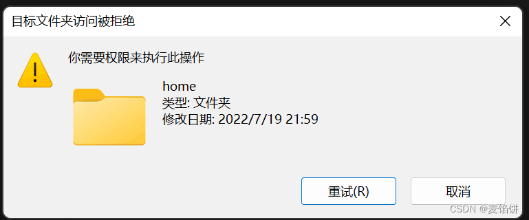

# WSL中LaTex的安装与配置

### 更换镜像源

第一次用WSL跑apt最好先更换合适的镜像源，可以用鱼香ros的一键工具来换源，只需在终端输入以下命令：

> ```bash
> wget http://fishros.com/install -O fishros && . fishros
> ```

### 使用apt安装Texlive

输入以下命令：

> ```bash
> sudo apt install texlive-full
> ```

- （通过这种方式安装好的 texlive 不一定是最新的。安装完成后可以用以下命令查看texlive版本：）

  > ```bash
  > latex -v
  > ```

### 在wsl中使用windows字体

若希望在wsl中使用windows字体，需安装`fontconfig`：

> ```bash
> sudo apt install fontconfig
> ```

然后在windows资源管理器中输入`\\wsl$`找到` /etc/fonts/`，在这个文件夹下新建一个文件`local.conf`， 添加以下内容：

> ```
> <?xml version="1.0"?>
> <!DOCTYPE fontconfig SYSTEM "fonts.dtd">
> <fontconfig>
>     <dir>/mnt/c/Windows/Fonts</dir>
> </fontconfig>
> ```

> **如果提示无权限修改文件，像这样：**
>
> 那么我们就需要提权，在Windows Powershell中输入以下代码（不用纠结当前在哪个路径下）：
>
> ```
> ubuntu2204.exe config --default-user root
> ```
>
> 然后用`shutdown`命令关闭wsl后重启它，即可修改文件
>
> - **修改完以后记得改回默认用户（就是一开始安装wsl时让我们创建的那个新用户），否则无法正常访问之前自行创建的文件夹：**
>
> ```
> ubuntu2204.exe config --default-user doge   //doge是俺创的用户名^_^
> ```
>
> - 详情请参考这篇文章：[Windows直接访问WSL2路径并直接进行读写操作,权限不足的问题_wsl进入ubuntu后没有权限-CSDN博客](https://blog.csdn.net/qq_33412312/article/details/119720052)

然后使用`fc-cache -fv`刷新一下字体缓存，就可以使用 Windows 中的字体了。

### 在VSCode中使用

#### 配置Latex Workshop

在 VSCode 界面下按下 F1，然后键入“setjson”，点击“首选项: 打开用户设置(JSON)”

然后将以下代码放入设置区（记得要放在花括号里面而不是外面）：

> ```json
> "latex-workshop.latex.tools": [
>     {
>         // 编译工具和命令
>         "name": "xelatex",
>         "command": "xelatex",
>         "args": [
>             "-synctex=1",
>             "-interaction=nonstopmode",
>             "-file-line-error",
>             "-pdf",
>             "%DOCFILE%"
>         ]
>     },
>     {
>         "name": "pdflatex",
>         "command": "pdflatex",
>         "args": [
>             "-synctex=1",
>             "-interaction=nonstopmode",
>             "-file-line-error",
>             "%DOCFILE%"
>         ]
>     },
>     {
>         "name": "bibtex",
>         "command": "bibtex",
>         "args": [
>             "%DOCFILE%"
>         ]
>     }
> ],
> 
> "latex-workshop.latex.recipes": [
>         {
>             "name": "xelatex",
>             "tools": [
>                 "xelatex"
>             ]
>         },
>         {
>             "name": "pdflatex -> bibtex",
>             "tools": [
>                 "pdflatex",
>                 "bibtex"
>             ]
>         },
>         {
>             "name": "pdflatex -> bibtex -> pdflatex*2",
>             "tools": [
>                 "pdflatex",
>                 "bibtex",
>                 "pdflatex",
>                 "pdflatex"
>             ]
>         },
>         {
>             "name": "xelatex -> bibtex -> xelatex*2",
>             "tools": [
>             "xelatex",
>             "bibtex",
>             "xelatex",
>             "xelatex"
>             ]
>         },
>         {
>             "name": "xelatex -> bibtex -> xelatex",
>             "tools": [
>             "xelatex",
>             "bibtex",
>             "xelatex"
>             ]
>         }
>     ],
>     "latex-workshop.view.pdf.viewer": "tab",
>     "latex-workshop.latex.clean.fileTypes": [
>         "*.aux",
>         "*.bbl",
>         "*.blg",
>         "*.idx",
>         "*.ind",
>         "*.lof",
>         "*.lot",
>         "*.out",
>         "*.toc",
>         "*.acn",
>         "*.acr",
>         "*.alg",
>         "*.glg",
>         "*.glo",
>         "*.gls",
>         "*.ist",
>         "*.fls",
>         "*.log",
>         "*.fdb_latexmk"
>     ],
> ```

> - LaTex Workshop的默认编译器是LaTexmk，但是我们不用它，遂不在以上代码中配置它。

**完成以上全部工作后，就可以优雅地用VsCode+WSL来编辑LaTex文档啦（大概^_^）**

### 主要参考文档

[在WSL中安装LaTeX - 知乎 (zhihu.com)](https://zhuanlan.zhihu.com/p/202865739)

[使用VSCode编写LaTeX - 知乎 (zhihu.com)](https://zhuanlan.zhihu.com/p/38178015)

[Skipping undefined tool "xelatex" in recipe "xelatex." · Issue #2595 · James-Yu/LaTeX-Workshop (github.com)（适用于 Skipping undefined tool "<编译器名>" in recipe "<编译器名>" 报错）](https://github.com/James-Yu/LaTeX-Workshop/issues/2595)

