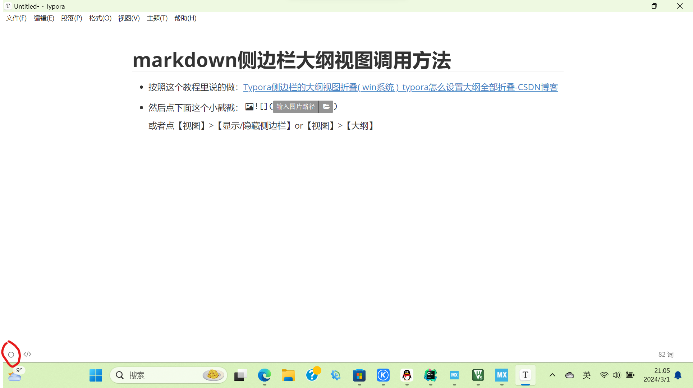
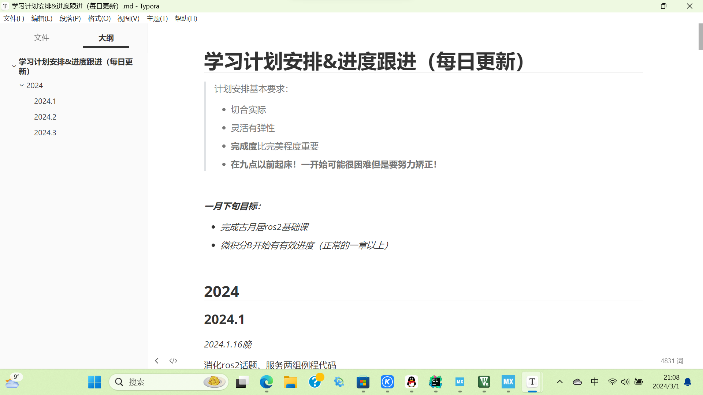

# markdown侧边栏大纲视图调用方法

- 按照这个教程里说的做：[Typora侧边栏的大纲视图折叠( win系统 )_typora怎么设置大纲全部折叠-CSDN博客](https://blog.csdn.net/tian_ci/article/details/85257667)

- 然后点左下角用红笔圈起来的这个小戳戳：

  或者点【视图】>【显示/隐藏侧边栏】or【视图】>【大纲】

效果如图：

