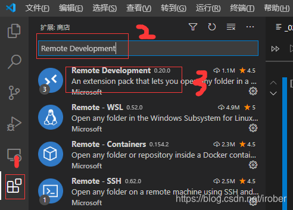
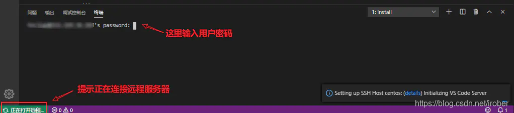

# 在VScode中远程操控Ubuntu虚拟机的方法

> - 主机系统：Windows 11
> - 虚拟机软件：VMware Workstation Pro 17
> - 虚拟机搭载系统：Ubuntu 22.04

## 通过ssh远程登陆虚拟机

### 使用ssh-keygen生成ssh公钥和私钥

在Windows主机终端输入命令：

```
ssh-keygen -t rsa
```

> 此命令将生成一个私钥文件（默认为`id_rsa`）和一个公钥文件（默认为`id_rsa.pub`）。
> 其中私钥是必须保存在.ssh目录中的，只有该主机的该用户可以使用。而公钥是给需要使用ssh验证的服务器，使用密钥对可以免密码验证，比如ssh,scp,rsync等。

### 将公钥分发至目标虚拟机

首先打开虚拟机终端，安装openssh-server软件包：

> 若已安装则忽略此步，不过一般的ubuntu发行版大概率默认未安装此软件包。

```
sudo apt install openssh-server
```

然后将公钥文件移入虚拟机。

> 我的虚拟机已正常安装vmware tools，因此可以直接将主机中的东西拷贝到虚拟机中。
>
> 若未安装vmware tools也可采取其他办法导入公钥文件（我暂时找不到别的办法^_^），反正这个移入的文件只是起到一个公钥临时载体的作用，最终目的是把公钥加到虚拟机.shh文件夹下的`authorized_keys`中。

接着在虚拟机终端输入：

```
cat <移入的公钥所在文件夹>/id_rsa.pub >> ~/.ssh/authorized_keys
```

现在，我们已经成功将公钥添加到目标主机上现有的~/.ssh/authorized_keys文件的末尾，而不会覆盖它。

### 在Windows主机终端直接登陆虚拟机

向目标虚拟机的user用户的.ssh/authorized_keys中添加源主机用户的公钥信息后，就可以在Windows主机直接使用ssh免密登录虚拟机了。在Windows主机终端输入以下命令：

```
ssh user@target_host
# “user@target_host”就是你在ubuntu虚拟机终端输入提示符中总能看到的“xxx@xxx”
```

如果一切顺利，我们应该能够在不输入密码的情况下成功登录到目标主机。

若登陆成功，Windows主机终端会显示如下画面：


## 在VSCode中配置远程编辑

### 配置远程开发插件Remote Development

在VSCode扩展商店中搜索`Remote Development`并安装：




安装完成后，vscode左侧多出一个长得像电脑的菜单栏，即远程资源管理器。我们点开远程资源管理器，然后按照下图所示步骤操作：


接着在VSCode的设置-扩展中找到Remote-SSH，将其中的`Show Login Terminal`选中：


做完以上这些后，你就可以在vscode的远程资源管理器中看到一个你配置好了的远程服务器，就可以连接了：


然后就会在当前窗口或新窗口中打开远程界面，在其下弹出的终端中可以看到输入密码的提示，输入目标虚拟机的密码即可。

> 如果已经在之前配ssh的步骤中，直接在Windows终端登陆了虚拟机，这里就不会再弹出输入密码的提示，可以直接在VSCode中进行远程操作了。

此时你的vscode就工作在远程服务器中了：



让我们来打开一个文件夹：


此时我们就可以像平常那样直接用vscode的资源管理器来管理我们的文件了。
如果我们想要打开远程服务器的shell，那么可以像在本地那样直接在终端中打开就好了：


完成！接下来就可以愉快地在VSCode中编辑Ubuntu虚拟机中的文件啦！

> 主要参考文档：
>
> - [windows下使用vscode远程连接Linux服务器进行开发-CSDN博客](https://blog.csdn.net/irober/article/details/112724986)
> - [如何在 Ubuntu 20.04 上安装启用 SSH - 知乎 (zhihu.com)](https://zhuanlan.zhihu.com/p/146976128)

